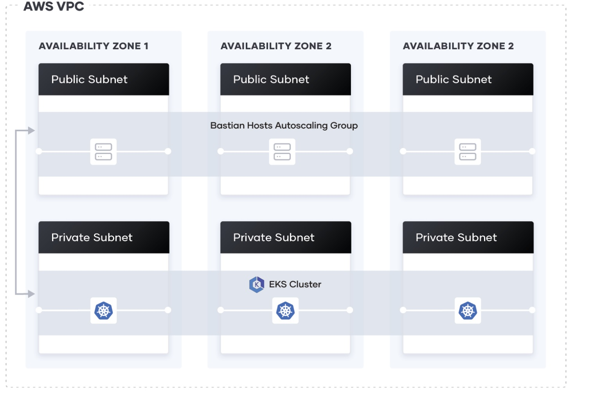

### 1. aws eks deploy by terraform

#### 아키텍쳐

* terraform에서 예제로 제공되는 기본 architecture 로 구성



#### eks 설치
* ap-northeast-2 리전에 설치하며 t3.small 사양으로 1개 노드만 구성
```
varriables.tf
variable "region" {
  description = "AWS region"
  type        = string
  default     = "ap-northeast-2"
}
```
```
eks-cluster.tf
  eks_managed_node_groups = {
    one = {
      name = "node-group-1"

      instance_types = ["t3.small"]

      min_size     = 1
      max_size     = 1
      desired_size = 1
```

```
# terrform 초기세팅
terraform init

# terrform 수행 Plan
terraform plan

# terrform 수행 
terraform apply

# terrform 상태
terrform show

# terrform 삭제
terrform destroy

```


### 2. SpringBoot 어플리케이션 컨네이너 이미지 만들기

* springboot 소스 빌드
```text
# springboot pom.xml 경로에서 maven 빌드
mvnw package
```
* Dockerfile
```text
# 소스를 내부 컨테이너에 복사하여 java로 기동
FROM wspark83/springboot:openjdk8-custom

# maintainer
LABEL maintainer="jjomacson@gmail.com"
# timezone setting
ENV TZ=Asia/Seoul
# root user
USER root
# for application log
RUN mkdir -p /logs

# maven
ARG JAR_FILE=target/demo-0.0.1-SNAPSHOT.jar

COPY ${JAR_FILE} /app.jar

RUN chown jboss:root /logs
RUN chown jboss:root /app.jar

EXPOSE 8080

ENTRYPOINT ["java","-jar","/app.jar"]

```

* 컨테이너 이미지 빌드하고 이미지저장소에 Push

```text
# 환경변수 확인(이미지 Repository/IMAGE_NAME/TAG)
./script/env.sh
#!/bin/sh
export CONTAINER_NAME=sample-v1.1
export IMAGE_NAME=wspark83/springboot
export REGISTRY="docker.io"
export TAG=sample-v1.1

#컨테이너 이미지 빌드 및 Push
# build.sh 내용
#!/bin/sh
. ./env.sh
buildah bud --format=docker -t ${REGISTRY}/${IMAGE_NAME}:${TAG} ../
buildah login -u wspark83 -p "password" ${REGISTRY}
buildah push  ${REGISTRY}/${IMAGE_NAME}:${TAG}

#build.sh 실행
$ ./build.sh

- buildah 실행안되는 경우 binary 설치 필요(podman/docker로 변경가능)
```

### k8s에서 배포하기
```text
# namespace 생성
kubectl create namespace wspark

# deployment 생성
kubectl create deployment springboot-demo --image docker.io/wspark83/springboot:sample-v1.1  -n wspark

# 외부접속용 svc nodeport 변경
kubectl expose deployment springboot-demo --port 8080 --target-port 8080 --type NodePort -n wspark

# nodeport 확인
kubectl get svc -n wspark
NAME              TYPE       CLUSTER-IP      EXTERNAL-IP   PORT(S)          AGE
springboot-demo   NodePort   10.101.65.210   <none>        8080:31236/TCP   2d1h

# 서비스호출
curl 10.65.41.81:31236
hostname : springboot-demo-6b9fc99f58-7vlfr!, os : Linux!

```


## Reference 참고 링크
* [https://learn.hashicorp.com](https://learn.hashicorp.com/tutorials/terraform/eks)

