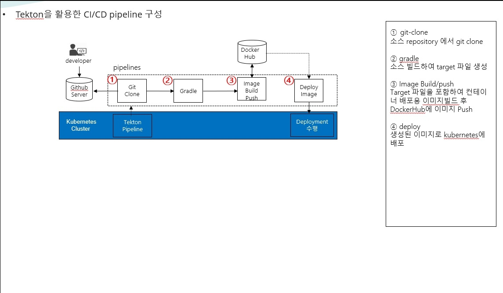
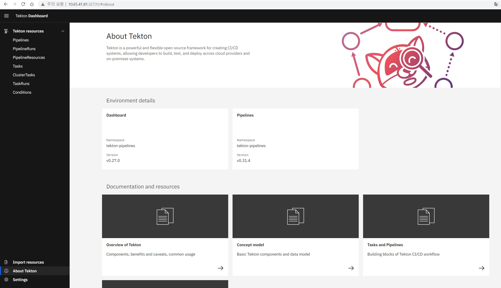
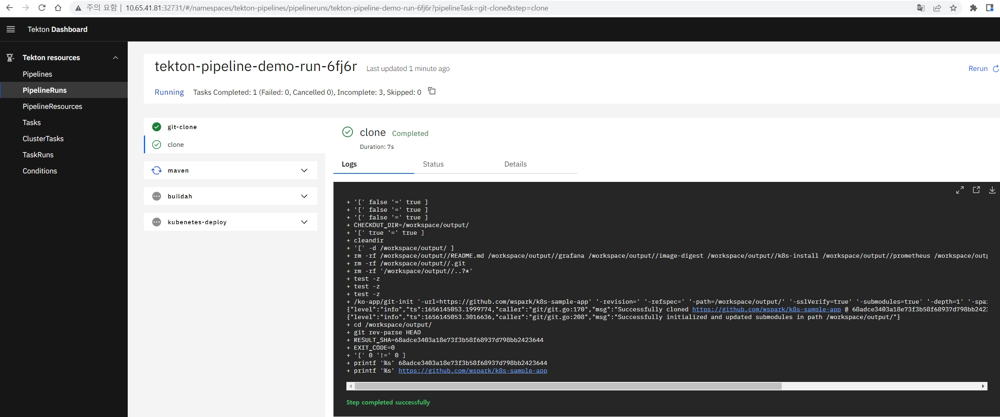

# tekton 구성

## tekton CI/CD 구성

* tekton 을 이용하여 git-clone -> maven build -> image build/push -> deploy(k8s) 의 CI/CD를 구현함.



## tekton 설치

* takton 엔진/대쉬보드를 구성하며 yaml을 이용한 설치로 진행(https://tekton.dev/docs/pipelines/install/)
```text
# tekton engine install
kubectl apply -f https://storage.googleapis.com/tekton-releases/pipeline/previous/v0.31.4/release.yaml
# tekton dashboard install
kubectl apply --filename https://storage.googleapis.com/tekton-releases/dashboard/latest/tekton-dashboard-release.yaml

# tekton component 확인
kubectl get all -n tekton-pipelines
NAME                                              READY   STATUS    RESTARTS   AGE
pod/tekton-dashboard-55f695f747-grtsv             1/1     Running   0          101s
pod/tekton-pipelines-controller-844fdd85b-wsxmz   1/1     Running   0          2m47s
pod/tekton-pipelines-webhook-549d8b8bcf-djfmg     1/1     Running   0          2m47s

NAME                                  TYPE        CLUSTER-IP      EXTERNAL-IP   PORT(S)                              AGE
service/tekton-dashboard              ClusterIP   10.107.63.255   <none>        9097/TCP                             101s
service/tekton-pipelines-controller   ClusterIP   10.102.29.12    <none>        9090/TCP,8008/TCP,8080/TCP           2m47s
service/tekton-pipelines-webhook      ClusterIP   10.104.237.72   <none>        9090/TCP,8008/TCP,443/TCP,8080/TCP   2m47s

NAME                                          READY   UP-TO-DATE   AVAILABLE   AGE
deployment.apps/tekton-dashboard              1/1     1            1           101s
deployment.apps/tekton-pipelines-controller   1/1     1            1           2m47s
deployment.apps/tekton-pipelines-webhook      1/1     1            1           2m47s

NAME                                                    DESIRED   CURRENT   READY   AGE
replicaset.apps/tekton-dashboard-55f695f747             1         1         1       101s
replicaset.apps/tekton-pipelines-controller-844fdd85b   1         1         1       2m47s
replicaset.apps/tekton-pipelines-webhook-549d8b8bcf     1         1         1       2m47s

NAME                                                           REFERENCE                             TARGETS          MINPODS   MAXPODS   REPLICAS   AGE
horizontalpodautoscaler.autoscaling/tekton-pipelines-webhook   Deployment/tekton-pipelines-webhook   <unknown>/100%   1         5         1          2m47s

# tekton svc NodePort 변경
kubectl patch service/tekton-dashboard -p '{"spec":{"type":"NodePort"}}' -n tekton-pipelines
kubectl get svc -n tekton-pipelines
NAME                          TYPE        CLUSTER-IP      EXTERNAL-IP   PORT(S)                              AGE
tekton-dashboard              NodePort    10.107.63.255   <none>        9097:32731/TCP                       4m30s
tekton-pipelines-controller   ClusterIP   10.102.29.12    <none>        9090/TCP,8008/TCP,8080/TCP           5m36s
tekton-pipelines-webhook      ClusterIP   10.104.237.72   <none>        9090/TCP,8008/TCP,443/TCP,8080/TCP   5m36s

```

* tekton 대쉬보드 접속 URL http://$k8s클러스터IP:32731


## tekton Task/pipeline


### tekton Task 생성
```text
# git clone task
kubectl create -f https://raw.githubusercontent.com/tektoncd/catalog/main/task/git-clone/0.6/git-clone.yaml -n tekton-pipelines
# maven task
kubectl create -f https://raw.githubusercontent.com/tektoncd/catalog/main/task/maven/0.2/maven.yaml -n tekton-pipelines
# gradle task
kubectl create -f  https://raw.githubusercontent.com/tektoncd/catalog/main/task/gradle/0.1/gradle.yaml -n tekton-pipelines
# buildah task(image build)
kubectl create -f https://raw.githubusercontent.com/tektoncd/catalog/main/task/buildah/0.3/buildah.yaml -n tekton-pipelines
# deploy task(kubectl commander)
kubectl create -f https://raw.githubusercontent.com/tektoncd/catalog/main/task/kubernetes-actions/0.2/kubernetes-actions.yaml -n tekton-pipelines

```

### tekton workspace(PVC 생성)

* tekton pipeline 수행간에 데이터 저장용 workspace
```text
kubectl create -f tekton-pv.yaml 
kubectl create -f tekton-pvc.yaml 
```
## tekton 수행

### tekton binary 설치(http://github.com/tektoncd/cli)

```text
curl -LO https://github.com/tektoncd/cli/releases/download/v0.24.0/tkn_0.24.0_Linux_x86_64.tar.gz
# Extract tkn to your PATH (e.g. /usr/local/bin)
tar xvzf tkn_0.24.0_Linux_x86_64.tar.gz -C /usr/local/bin/ tkn
```

### tekton pipeline

tekton ci/cd 구성에 필요한 task를 수행순서에 따라 pipeline을 생성하여 git-clone -> maven -> 이미지 빌드/푸시(dockerhub) -> deploy(k8s deploy)순으로 작성

```text
# pipeline 생성(maven,gradle)
kubectl create -f pipeline-[maven,gradle].yaml -n tekton-pipelines
```

```text
apiVersion: tekton.dev/v1beta1
kind: Pipeline
metadata:
  name: tekton-pipeline-gradle-demo
spec:
  tasks:
    - name: git-clone
      params:
        - name: url
          value: 'https://github.com/wspark/k8s-springboot-cicd'
      taskRef:
        kind: Task
        name: git-clone
      workspaces:
        - name: output
          workspace: pipeline-shared-data
    - name: gradle
      params:
        - name: PROJECT_DIR
          value: "springboot-sample"
      runAfter:
        - git-clone
      taskRef:
        kind: Task
        name: gradle
      workspaces:
        - name: source
          workspace: pipeline-shared-data
    - name: buildah
      params:
        - name: IMAGE
          value: docker.io/wspark83/springboot:demo-v1.5
        - name: STORAGE_DRIVER
          value: overlay
        - name: DOCKERFILE
          value: ./Dockerfile
        - name: CONTEXT
          value: springboot-sample
        - name: TLSVERIFY
          value: 'false'
        - name: FORMAT
          value: oci
        - name: SKIP_PUSH
          value: 'false'
      runAfter:
        - gradle
      taskRef:
        kind: Task
        name: buildah
      workspaces:
        - name: source
          workspace: pipeline-shared-data
        - name: sslcertdir
          workspace: pipeline-shared-data
    - name: kubenetes-deploy
      params:
        - name: script
          value: "kubectl set image deployment/springboot-demo springboot=docker.io/wspark83/springboot:demo-v1.5 -n wspark"
      runAfter:
        - buildah
      taskRef:
        kind: Task
        name: kubernetes-actions
      workspaces:
        - name: kubeconfig-dir
          workspace:  pipeline-shared-data
  workspaces:
    - name: pipeline-shared-data
```

* git-clone task
```text
params.url: git 저장소 주소
Ex)https://github.com/wspark/k8s-sample-app
```

* maven task
```text
params.GOALS : maven 수행시 수행되는 파라미터
params.CONTEXT: pom 파일위치
Ex)params.GOALS: package
Ex)params.CONTEXT: springboot-sample
```
* gradle task
```text
params.PROJECT_DIR : build.gradle 위치
Ex)params.PROJECT_DIR: springboot-sample
```

* buildah task 
```text
params.IMAGE: 컨테이너 빌드후 만들어지는 이미지명
params.CONTEXT: git repo의 dockerfile 위치
params.DOCKERFILE: git repo의 docker파일명
Ex) params.IMAGE: docker.io/wspark83/springboot:demo-v1.2
Ex) params.CONTEXT: springboot-sample
Ex) params.DOCKERFILE: ./Dockerfile
```
* kubernetes-actions task 
```text
params.script: kubectl 커맨드를 같이 수행할 파라미터
Ex) params.script: kubectl set image deployment/springboot-demo springboot=docker.io/wspark83/springboot:demo-v1.3 -n wspark
```

### tekton pipelinerun/log

* tkn cli로 pipeline 수행시 pipeline 이름/workspace/claimeName을 파라미터로 실행함
```text
# pipeline 수행
tkn pipeline start tekton-pipeline-gradle-demo  --workspace name=pipeline-shared-data,claimName=tekton -n tekton-pipelines
PipelineRun started: tekton-pipeline-gradle-demo-run-4hsnm
# pipelinelog 확인
tkn pipelinerun logs tekton-pipeline-gradle-demo-run-4hsnm -f -n tekton-pipelines

```

* teton dashboard를 통해서도 로그 확인가능



### tekton pipelinerun deploy 실패

* pipeline 수행시 tekton-pipelines 프로젝트의 default serviceaccout로 수행하는데 해당 account가 배포하려는 프로젝트에 권한이 없어
에러 발생하면 clusterrole,clusterrolebind 추가

```text
## error message
Error from server (Forbidden): deployments.apps "springboot" is forbidden: User "system:serviceaccount:tekton-pipelines:default" cannot get resource "deployments" in API group "apps" in the namespace "wspark"

# clusterrole 생성
kubectl create -f clusterrole.yaml -n tekton-pipelines
# clusterrolebindg 
kubectl create -f clusterrolebinding.yaml -n tekton-pipelines

```


## Reference 참고 링크
* [tekton install](https://tekton.dev/docs/pipelines/install/)
* [tekton task hub](https://hub.tekton.dev/) 
* [tekton run issue](https://github.com/tektoncd/pipeline/issues/2236)